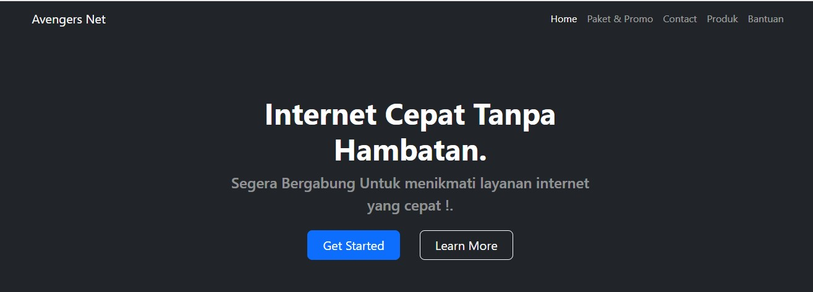

# Kelompok: Avengers Company
  * Project Manager (PM) : M. Febrian Hasibuan 
  * Quality Assurance (QA) : Cindy
  * Front End (FE) :
    - M. Bintang Firdaus
    - Rendy Lutfi Prabowo
    - Yogi Andaru

# Pendahuluan
Selamat datang di Github kelompok **Avengers Company** 😄. Di sini menampilkan tentang website IndiHome, semoga website ini bermanfaat untuk semua. 

Dalam era digital yang semakin maju seperti sekarang ini, internet cepat menjadi kebutuhan yang sangat penting. Setiap orang tentunya ingin memiliki internet cepat untuk kepentingan kegiatan digital yang dilakukan. 
Untuk mendapatkan manfaat penuh dari internet cepat, penting bagi kita untuk memastikan bahwa kita memiliki pasang internet rumah terbaik yang tersedia. Salah satu penyedia layanan internet cepat yaitu Avengers Net, kami menawarkan layanan internet cepat dengan kualitas yang tak tertandingi.

Tujuan : Menyediakan suatu layanan untuk internet cepat yang berkualitas tanpa hambatan. 

Manfaat :
1. Meningkatkan Kepuasan dan Kepercayaan Pelanggan
2. Akses Informasi dengan Cepat dan Mudah
3. Melancarkan Komunikasi Jarak Jauh
4. Streaming Konten Multimedia dengan Kualitas Tinggi
5. E-commerce dan Perdagangan Online
6. Pembelajaran Jarak Jauh dan E-Learning
7. Inovasi Teknologi dan Pengembangan Aplikasi

People with the spirit of learning, lets start! 😉👍

# Source Code
Berkas Source Code ini dapat kalian akses di GitHub **Avengers Company** yang dapat anda akses di : https://github.com/avengers_company.
Source code ini hanya dapat digunakan untuk member kelas "Pelatihan Junior Web Programming" dan tidak diizinkan untuk disebarkan kepada pihak selain member tersebut.

# Desain
Berkas ini dapat kalian akses di Figma pada tautan berikut :
[https://www.figma.com/Avengers-Company](https://www.figma.com/file/TzImGq1ILWQdQFvMi19EtJ/Avengers-Company?type=design&node-id=0%3A1&mode=dev)

# Visual Studio Code
Sebelum memulai membuat website, salah satu yang harus disiapkan adalah Code Editor. Disini kami merekomendasikan **Visual Studio Code** sebagai code editor. Selain gratis, anda bisa memasang ekstensi yang membuat code editor kalian berjalan dengan baik. Instalasi VSC bisa kalian unduh di https://code.visualstudio.com.

### Ekstensi
Ekstensi yang digunakan dalam pembuatan website ini menggunakan : PHP, CSS, dan JavaScript.

# Website Tutorial's
1. Akses link : https://kgemgbpneg.us-east-1.awsapprunner.com/
2. Tampilan Dashboard Landing Page
   
   
3. Terdapat beberapa pilihan Paket Berbayar untuk internet cepat
   
4. Tampilan Testimoni dari customer
   
5. Memberi pesan dengan layanan kami dengan cara mengisi data diri terlebih dahulu
    

# TERIMA KASIH, Semoga Bermanfaat 😉
